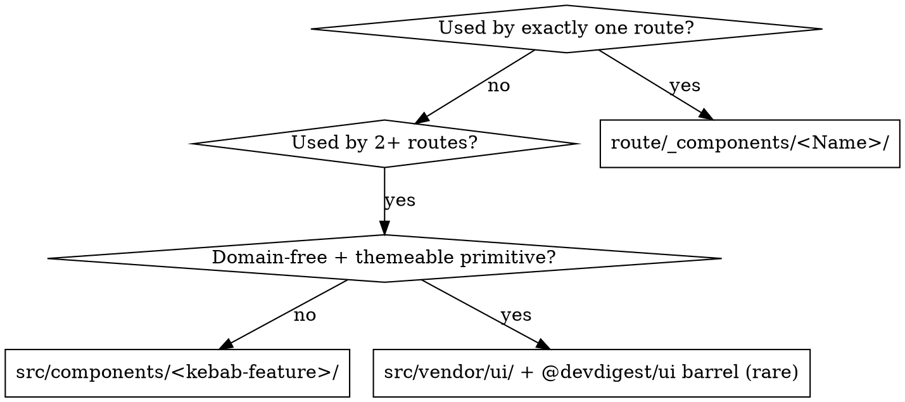

# Frontend Architecture — client/

**Version:** 1.0.0 · scope: `client/` (`@devdigest/web`, Next.js 15 App Router)

Placement, naming and boundaries. This skill answers *where does this file go and what is it
allowed to import* — nothing else. See [client/AGENTS.md](../../../client/AGENTS.md) for the
package contract and `client/docs/ui-architecture.md` for the Server/Client boundary.

## Where things live

| What | Path | Real example |
|---|---|---|
| Route | `client/src/app/<segment>/page.tsx` — thin | `src/app/repos/[repoId]/pulls/page.tsx` |
| Page-local component | `src/app/<route>/_components/<Name>/<Name>.tsx` + `index.ts` | `.../pulls/[number]/_components/FindingsPanel/` |
| Component-local child | `_components/<Parent>/_components/<Child>/` | `.../RunTraceDrawer/_components/TraceBody/` |
| Route-level non-component files | `constants.ts` · `helpers.ts` · `styles.ts` at the route root | `src/app/repos/[repoId]/pulls/{constants,helpers,styles}.ts` |
| Cross-route component | `src/components/<kebab-feature>/` (PascalCase subfolder per component) | `src/components/diff-viewer/DiffViewer/` · `src/components/app-shell/` |
| Design system | `src/vendor/ui/` — consume via the `@devdigest/ui` barrel only | `import { Skeleton, EmptyState } from "@devdigest/ui"` |
| Data hook | `src/lib/hooks/<domain>.ts`, exported from `src/lib/hooks/index.ts` | `src/lib/hooks/reviews.ts` → `usePrRuns` |
| HTTP | only `src/lib/api.ts` (`api`, `apiFetch`, `ApiError`, `API_BASE`) | `src/lib/hooks/reviews.ts` calls `api.get(...)` |
| Contracts | `src/vendor/shared/` (`@devdigest/shared`) — a COPY of the server's | `import type { RunEvent } from "@devdigest/shared"` |
| UI strings | `client/messages/en/<ns>.json` + `useTranslations("<ns>")` | `messages/en/prReview.json` → `t("list.title")` |
| Component test | beside the component: `<Name>/<Name>.test.tsx` | `_components/PRRow/PRRow.test.tsx` |
| Pure-logic test | beside the `helpers.ts` it covers: `helpers.test.ts` | `.../pulls/helpers.test.ts` · `.../FindingsPanel/helpers.test.ts` |

## Placement decision



## Rules

1. **Pages stay thin.** `page.tsx` reads params/search, calls hooks, composes `_components`. Business
   logic and markup detail move into `_components/<Name>/` or the route's `helpers.ts`.
2. **Component folder = PascalCase folder + same-named file + `index.ts` barrel.** Import the folder,
   never the inner file: `import { PRRow } from "./_components/PRRow"`.
3. **Fixed internals only:** `constants.ts` · `helpers.ts` · `styles.ts`. Never invent a sibling
   (`utils.ts`, `types.ts`, `use-x.ts` inside a component folder).
4. **Components never fetch.** Data comes from a hook in `src/lib/hooks/`; the hook is the only caller
   of `src/lib/api.ts`. No `fetch(` and no `API_BASE` inside `src/app/**` or `src/components/**`.
5. **Design system via the barrel.** `@devdigest/ui` only — never a layer file inside `src/vendor/ui`.
6. **Colors only via CSS vars** (`var(--accent)`, `var(--border)`); theme switches on `data-theme`.
   No hex literal in `styles.ts`.
7. **No hardcoded UI text.** New feature = new `messages/en/<ns>.json`, auto-merged by
   `src/i18n/request.ts` — no registration step.
8. **New or changed shared UI component → add it to `src/components/showcase`** (the smoke test mounts
   the gallery).
9. **Contract change → update both copies** (`client/src/vendor/shared` and `server/src/vendor/shared`);
   they have already diverged.
10. **Test sits beside its subject**, never in a `__tests__/` folder, never mirrored under a top-level
    `tests/` dir. `pnpm test` (vitest + jsdom, `fetch` mocked) must pass with no API running.

## Good / bad — real paths

**Good** — page-local panel, barrel import, hook for data, i18n, colocated test:

```
client/src/app/repos/[repoId]/pulls/[number]/_components/FindingsPanel/
  FindingsPanel.tsx        # "use client", props in, no fetch
  FindingsPanel.test.tsx   # beside the component
  helpers.ts               # pure severity/filter logic
  helpers.test.ts          # beside the helpers
  constants.ts  styles.ts  index.ts
```

```tsx
// client/src/app/repos/[repoId]/pulls/page.tsx
import { Skeleton, EmptyState } from "@devdigest/ui";
import { usePulls } from "@/lib/hooks";
import { PRRow } from "./_components/PRRow";
import { s } from "./styles";
```

**Bad** — every line below breaks a rule:

```tsx
// client/src/app/repos/[repoId]/pulls/PullsTable.tsx        ← component outside _components/<Name>/
import { Badge } from "@/vendor/ui/kit/Badge";               // ← deep import, not the barrel
const rows = await fetch(`${API_BASE}/repos/${id}/pulls`);   // ← fetch in a component, not a hook
const style = { color: "#7c5cff" };                          // ← hex instead of var(--accent)
return <th>Findings</th>;                                    // ← literal string, not t("list.columns.findings")
// test placed at client/tests/PullsTable.test.tsx           ← must be PullsTable/PullsTable.test.tsx
```

## Do not

- Do not add a `[locale]` segment — single locale `en`, no locale routing.
- Do not create a route-level `components/` (no underscore) — private folders are `_components`.
- Do not import a page-local `_components` folder from another route; promote it to `src/components/` instead.
- Do not put domain logic in `src/vendor/ui` — it is the design system, not the app.

## Defer to

| Question | Skill |
|---|---|
| Hooks rules, memoization, state shape, anti-patterns | `react-best-practices` |
| Server/Client components, `metadata`, async params, route handlers | `next-best-practices` |
| How to write the colocated test (queries, `userEvent`, async) | `react-testing-library` |
| Server-side layering for the API this UI calls | `onion-architecture` |
